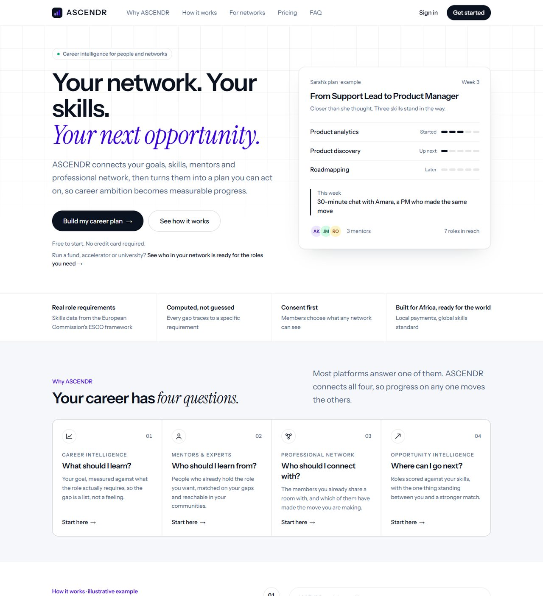
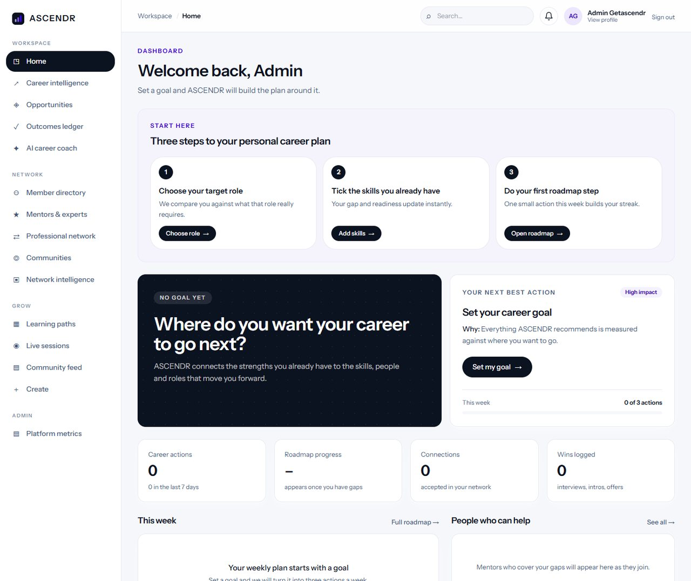
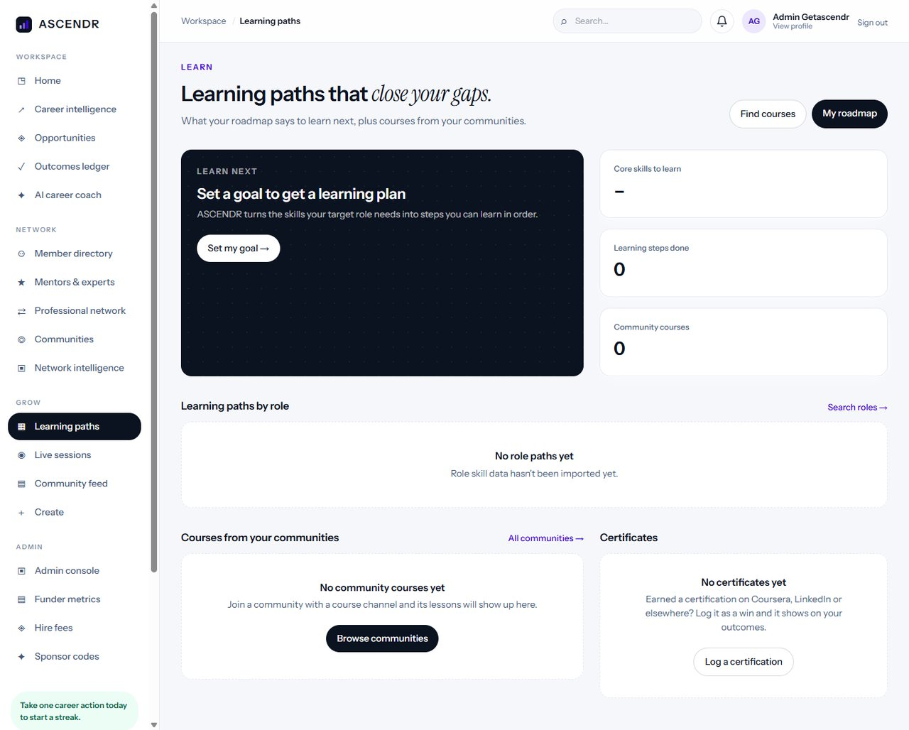
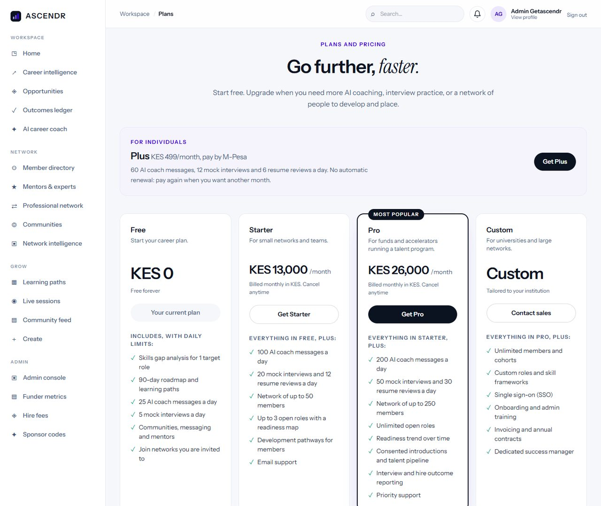
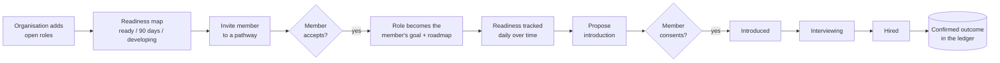
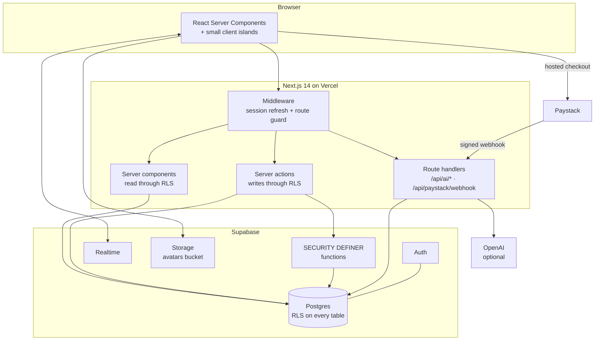
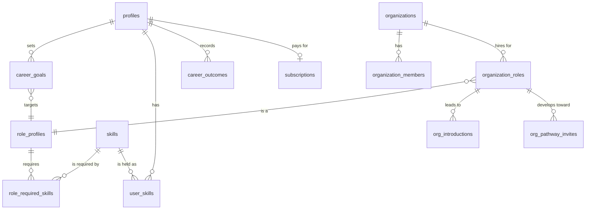
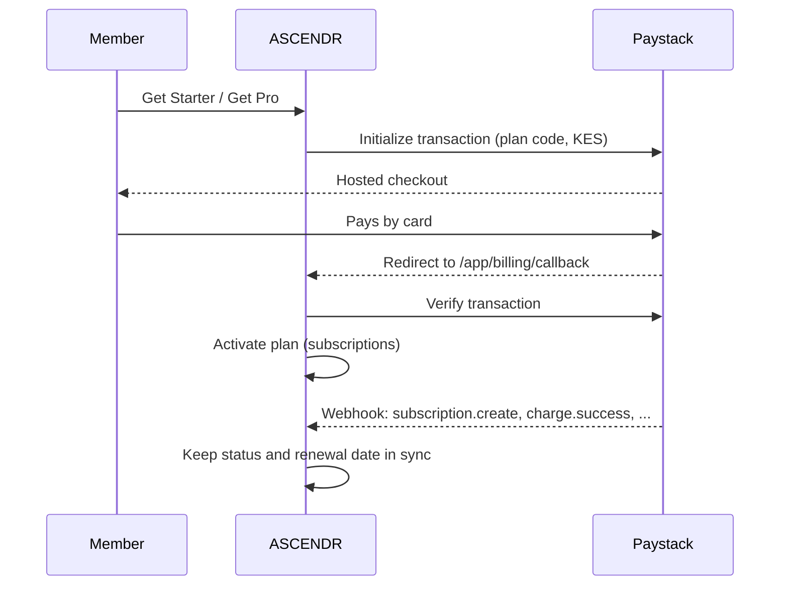

<div align="center">


### Career intelligence for people and the networks that develop them

ASCENDR shows members exactly what stands between them and the role they want, and shows funds, accelerators and universities who in their network is ready, who is close, and what it will take to get them there.


-0BA4DB)


[Live app](https://ascendr-two.vercel.app) · [Networks demo](https://ascendr-two.vercel.app/networks) · [Plans and pricing](https://ascendr-two.vercel.app/app/plans) · [Architecture](ARCHITECTURE.md) · [Product requirements](PRD.md) · [Security audit](SECURITY-AUDIT.md)

</div>

---

## Contents

- [Why ASCENDR](#why-ascendr)
- [Who it is for](#who-it-is-for)
- [What the product does](#what-the-product-does)
- [Screenshots](#screenshots)
- [The network pilot workflow](#the-network-pilot-workflow)
- [Plans](#plans)
- [Architecture](#architecture)
- [Technology](#technology)
- [Getting started](#getting-started)
- [Environment variables](#environment-variables)
- [Database and migrations](#database-and-migrations)
- [Skills and roles data](#skills-and-roles-data)
- [Payments](#payments)
- [Project structure](#project-structure)
- [Engineering principles](#engineering-principles)
- [Security and privacy](#security-and-privacy)
- [Quality checks](#quality-checks)
- [Deployment](#deployment)
- [Roadmap](#roadmap)
- [Documentation](#documentation)
- [Contributing](#contributing)
- [License](#license)

---

## Why ASCENDR

Most career tools stop at advice. Most talent platforms only find people who are **already** qualified, and only inside one employer.

ASCENDR covers the step in between. It measures each person against the **real skill requirements** of the role they want, builds the plan to close the gap, and lets the networks around them (funds, accelerators, universities) develop and introduce that talent with the member's consent.

| Question | How ASCENDR answers it |
|---|---|
| Where am I now? | A skills profile built from what the member actually documents |
| Where do I want to go? | A concrete target role from the ESCO framework of the European Commission |
| What am I missing? | A deterministic gap analysis against that role's essential skills |
| Who can help? | Mentors matched to the specific missing skill, with the reason shown |
| What should I do next? | A 30 / 60 / 90-day roadmap with trackable steps |
| Did it work? | An outcomes ledger that separates self-reported wins from confirmed ones |

> **Rule we never break:** ASCENDR never shows invented or guessed data about a person. Every number on screen traces back to a real row.

---

## Who it is for

<table>
<tr>
<td width="33%" valign="top">

**Members**

Professionals changing roles, growing into a new one, or preparing for their first. They get a clear gap, a plan, mentors and opportunities ranked by readiness.

</td>
<td width="33%" valign="top">

**Networks**

VC funds and accelerators with portfolio companies to hire for. They see who in their network is ready now, who is within 90 days, and who is developing, for every open role.

</td>
<td width="33%" valign="top">

**Institutions**

Universities and professional associations that want to develop whole cohorts toward the roles employers need, and report the outcomes.

</td>
</tr>
</table>

---

## What the product does

| Area | Capabilities |
|---|---|
| **Career intelligence** | Goal capture, skills gap against ESCO role requirements, readiness band, transferable skills, 90-day roadmap |
| **Learning** | Role learning paths, next learning step from the roadmap, course and video search for the exact missing skill, community courses |
| **People** | Member and mentor directories, mentors matched by missing skill, connection requests, real-time direct messages |
| **Communities** | Channels with real-time chat, reactions and unread tracking, live sessions with Q&A, polls and chat, mentor AI clones with cited answers |
| **Opportunities** | Opportunity matching by readiness, saved-opportunity tracker |
| **Outcomes** | Ledger of interviews, offers, hires and certifications with verification levels |
| **AI coach** | Career coach, career plan, interview practice and resume review, all metered by plan |
| **Networks** | Organisations, invite links, open roles, readiness map, skill supply vs demand, readiness trend, pathways, consented introductions, talent pipeline |
| **Platform** | Global search, notifications with deep links, profile photos and cover images, plans and Paystack billing, admin console |

---

## Screenshots

| Homepage | Member dashboard |
|---|---|
| \ | \ |

| Learning paths | Plans and pricing |
|---|---|
| \ | \ |

## The network pilot workflow

The loop no single competitor offers end to end. Each step is backed by the database, not by a mock-up.



- **Consent first.** Admins only see members who share their career data, and nothing goes to a company until the member says yes.
- **Evidence, not claims.** Every confirmed step is written to `career_outcomes` as `partner_confirmed`.

---

## Plans

| | Free | Starter | Pro | Custom |
|---|---|---|---|---|
| **Price** | KES 0 | KES 13,000 / month | KES 26,000 / month | Contact sales |
| **For** | Getting started | Small networks, serious job seekers | Funds and accelerators | Universities, large networks |
| AI coach messages / day | 25 | 100 | 200 | Custom |
| Mock interviews / day | 5 | 20 | 50 | Custom |
| Resume reviews / day | 3 | 12 | 30 | Custom |
| Network members | Join only | Up to 50 | Up to 250 | Unlimited |
| Open roles | – | 3 | Unlimited | Unlimited |
| Readiness trend, introductions, outcome reporting | – | – | Yes | Yes |

Daily limits are enforced in `src/lib/usage.ts`. Member and role caps are product terms and are not yet enforced in code (see [Roadmap](#roadmap)).

---

## Architecture



| Layer | Responsibility |
|---|---|
| **Middleware** | Refreshes the Supabase session on every request and sends signed-out visitors from `/app/*` to `/login?next=...` |
| **Server components** | All reads, using the member's own session so Row Level Security decides what they can see |
| **Server actions** | All writes. Anything that needs elevated rights calls a `SECURITY DEFINER` function that re-checks permission inside Postgres |
| **Route handlers** | AI calls (metered), the Paystack webhook (HMAC-verified), the checkout callback and notification deep links |
| **Postgres** | The source of truth. Gap analysis, readiness bands and network metrics are computed in SQL or plain TypeScript, never by a language model |

Full detail: [`ARCHITECTURE.md`](ARCHITECTURE.md). Ten-minute version: [`ARCHITECTURE-ESSENTIALS.md`](ARCHITECTURE-ESSENTIALS.md).

---

## Technology

| Layer | Choice | Why |
|---|---|---|
| Framework | Next.js 14 App Router, TypeScript strict | Server components keep data access on the server |
| UI | React 18, Tailwind CSS 3, Instrument Sans | One design system, no component library dependency |
| Database | Supabase Postgres, Row Level Security, pgvector | Authorization lives next to the data |
| Auth | Supabase Auth via `@supabase/ssr` cookies | Works in server components and middleware |
| Realtime | Supabase Realtime | Chat, DMs, notifications, live sessions |
| Storage | Supabase Storage, public `avatars` bucket with per-user folders | Profile photos and covers |
| AI | OpenAI `gpt-4o-mini`, `text-embedding-3-small` | Optional. The app runs fully without a key |
| Payments | Paystack (Kenya, KES, card subscriptions) | Available to Kenyan businesses, owned by Stripe |
| Skills data | ESCO v1.2 (European Commission) | Open, versioned, multilingual role and skill taxonomy |
| Hosting | Vercel, deploy on push to `main` | Zero-config for Next.js |

Five runtime dependencies. Adding one needs a written justification in the pull request.

---

## Getting started

**Prerequisites:** Node.js 20 or newer, a Supabase project. An OpenAI key and a Paystack account are optional.

```bash
# 1. Install
git clone https://github.com/moselanto/ascendr.git
cd ascendr
npm install

# 2. Configure
cp .env.example .env.local      # then fill in the values below

# 3. Create the database
#    Supabase dashboard > SQL Editor > run supabase/migrations/*.sql in order (0001 to 0017)

# 4. Load roles and skills (see "Skills and roles data")

# 5. Run
npm run dev                      # http://localhost:3000
```

Make an account an administrator (admin console at `/app/admin`):

```sql
update profiles set role = 'admin'
where auth_user_id = (select id from auth.users where email = 'you@example.com');
```

---

## Environment variables

| Variable | Required | Where it is used |
|---|---|---|
| `NEXT_PUBLIC_SUPABASE_URL` | Yes | Supabase project URL (Settings > API) |
| `NEXT_PUBLIC_SUPABASE_ANON_KEY` | Yes | Public anon key, used with RLS |
| `SUPABASE_SERVICE_ROLE_KEY` | Yes | **Server only.** Analytics, billing writes, admin console |
| `NEXT_PUBLIC_APP_URL` | Recommended | Canonical site URL for links and the payment callback |
| `OPENAI_API_KEY` | Optional | AI coach, plans, interviews, resume review, mentor clones |
| `OPENAI_MODEL` | Optional | Defaults to `gpt-4o-mini` |
| `OPENAI_EMBED_MODEL` | Optional | Defaults to `text-embedding-3-small` |
| `PAYSTACK_SECRET_KEY` | For billing | `sk_test_...` or `sk_live_...`. **Server only** |
| `PAYSTACK_PLAN_STARTER` | For billing | Paystack plan code for Starter (KES 13,000 / month) |
| `PAYSTACK_PLAN_PRO` | For billing | Paystack plan code for Pro (KES 26,000 / month) |

> Never put a secret in a `NEXT_PUBLIC_` variable. Those values are shipped to the browser.

Without `OPENAI_API_KEY`, AI features show a clear "not configured" state. Without the Paystack variables, upgrade buttons record early-access interest instead of charging.

---

## Database and migrations

Applied **in order**, by hand, in the Supabase SQL Editor. Every migration is idempotent and safe to re-run. Apply a migration **before** deploying the code that depends on it.

| # | File | Adds |
|---|---|---|
| 0001 | `phase1_foundation` | Profiles, communities, channels, feed, notifications, XP, live sessions, AI tables |
| 0002 | `rls_policies` | RLS helper functions and membership-scoped policies |
| 0003 | `realtime_reactions_reads_notifications` | Realtime, reactions, read receipts, notification inserts |
| 0004 | `mentor_clone_rag` | Mentor clone retrieval (`match_ai_chunks`) |
| 0005 | `live_sessions_qa` | Live session Q&A and votes |
| 0006 | `feed_reactions_comments` | Feed reactions and comments |
| 0007 | `networking` | Connections and direct messages |
| 0008 | `onboarding_goals` | Career goal fields on profiles |
| 0009 | `live_polls` | Live session polls |
| 0010 | `live_chat_presence_ai_studio` | Live chat, presence, saved career plans and resume reviews |
| 0011 | `career_graph` | Skills, roles, goals, actions, outcomes, privacy, quotas, analytics |
| 0012 | `saved_opportunities` | Saved-opportunity tracker |
| 0013 | `networks` | Organisations, invites, open roles, readiness map, skill supply |
| 0014 | `profile_headline_company` | Headline and current company on profiles |
| 0015 | `profile_photos` | Avatars storage bucket and policies, cover photo, location, website |
| 0016 | `network_pilot` | Readiness snapshots and trend, pathways, consented introductions, pipeline |
| 0017 | `billing` | Paystack subscriptions |



---

## Skills and roles data

Career intelligence needs real role requirements. ASCENDR uses **ESCO v1.2**, the European Commission's skills, competences and occupations framework.

| Method | When to use it |
|---|---|
| `npm run seed:esco` script | You have Node installed. Fetches roles from the ESCO API, upserts skills, roles and links, optionally embeds labels with OpenAI. Run with `node --env-file=.env.local scripts/seed-esco.mjs` (`--dry-run`, `--no-embed`, `--role "..."`) |
| One-file SQL import | No local tools. Paste the generated SQL into the Supabase SQL Editor |

Check the result:

```sql
select (select count(*) from role_profiles) as roles,
       (select count(*) from skills) as skills,
       (select count(*) from role_required_skills) as role_skills;
```

---

## Payments

Billing runs on **Paystack** in **KES**. Card subscriptions renew monthly. M-Pesa does not support automatic monthly debit, so it is not offered for subscriptions.



**Setup:** create two monthly KES plans in Paystack (Starter 13,000, Pro 26,000), set the three `PAYSTACK_*` variables, and point the webhook to `https://<your-domain>/api/paystack/webhook`. Test with card `4084 0840 8408 4081`, any future expiry, CVV `408`.

---

## Project structure

```
src/
├── app/
│   ├── page.tsx                  Public homepage
│   ├── login/                    Sign in and sign up, career intelligence showcase
│   ├── onboarding/               Goal capture
│   ├── networks/                 Public interactive networks demo
│   ├── auth/callback/            Email confirmation and session exchange
│   ├── api/
│   │   ├── ai/                   Metered AI route handlers
│   │   └── paystack/webhook/     Signed billing webhook
│   └── app/                      Signed-in product
│       ├── page.tsx              Dashboard and activation checklist
│       ├── career/               Gap analysis, roadmap, skills
│       ├── learn/                Learning paths by role
│       ├── opportunities/        Matching and tracker
│       ├── outcomes/             Outcomes ledger
│       ├── ai/                   Coach, plan, interview, resume
│       ├── members/ mentors/     People directories and profiles
│       ├── networking/           Connections and direct messages
│       ├── communities/          Channels, live sessions, mentor clones
│       ├── network/              Network intelligence (organisations)
│       ├── notifications/        History and deep links
│       ├── plans/ billing/       Pricing, checkout, subscription
│       ├── settings/             My profile, photos, account
│       ├── search/               Global search
│       └── admin/                Platform admin console
├── components/                   Shared UI (home, app, people, mentor, ui)
├── lib/
│   ├── career/                   Gap engine, roadmap, outcomes
│   ├── supabase/                 Browser, server, middleware and admin clients
│   ├── ai.ts                     The only place models are called
│   ├── usage.ts                  Plans, daily limits, tier lookup
│   ├── billing.ts                Paystack helpers
│   ├── notifications.ts          Deep links and relative time
│   └── analytics.ts              First-party product events
└── middleware.ts                 Session refresh and route guard
supabase/migrations/              0001 to 0017
scripts/seed-esco.mjs             ESCO import
public/login/                     Sign-in imagery
```

---

## Engineering principles

1. **Two user IDs.** `auth.users.id` is the login. `profiles.id` is the person. Every product table references `profiles.id`; resolve it with `getCurrentProfile()` or `current_profile_id()`.
2. **RLS is the authorization layer.** Application code never filters for security. Policies and `SECURITY DEFINER` functions do, inside Postgres.
3. **Deterministic logic, narrated by AI.** Gaps, readiness bands, matches and metrics are computed in SQL or TypeScript. Models explain and coach; they never decide.
4. **No invented data.** Empty states instead of filler. No fake percentages, no fabricated social proof.
5. **Consent before exposure.** Network admins see only members who share. Introductions require the member's yes.
6. **The app runs without optional services.** No OpenAI key or Paystack keys must never break a page.
7. **Every AI call is metered.** `consumeQuota()` before the model, by plan tier.

The full rule set for contributors and coding agents is in [`AGENTS.md`](AGENTS.md).

---

## Security and privacy

| Control | Implementation |
|---|---|
| Authorization | RLS on every sensitive table; elevated writes only through permission-checking `SECURITY DEFINER` functions |
| Service role | Server only, never imported in client components (runtime guard in `lib/supabase/admin.ts`) |
| Payments | No card data touches ASCENDR. Webhook verified with HMAC-SHA512 and a constant-time comparison |
| Storage | Members can write only inside a folder named after their own user ID |
| AI cost | Per-user daily quotas per route and tier |
| Redirects | Return paths after sign-in are sanitised to same-site relative URLs |
| Network data | Admins read members through aggregate functions that respect each member's sharing switch |

Open findings and their status: [`SECURITY-AUDIT.md`](SECURITY-AUDIT.md).

---

## Quality checks

```bash
npx tsc --noEmit -p .                                          # type check
npx tsc --noEmit -p . --noUnusedLocals --noUnusedParameters    # no dead code
npm run lint                                                   # Next.js ESLint rules
npm run build                                                  # production build
```

Every change should pass all four before it is merged.

---

## Deployment

Vercel deploys `main` automatically.

1. Apply any new migration in Supabase first.
2. Set the [environment variables](#environment-variables) for Production and Preview.
3. Push to `main` and confirm the build is green.
4. If billing is enabled, confirm the Paystack webhook URL points at the production domain.

---

## Roadmap

| Status | Item |
|---|---|
| Next | Enforce plan caps for network members and open roles |
| Next | Custom-plan enquiries delivered to the sales inbox |
| Next | Avatars in every people list |
| Planned | Opportunity ingestion from public job boards |
| Planned | Independent skill assessments as verification evidence |
| Planned | Test suite and CI on every pull request |
| Planned | Supabase CLI with linked staging and production |

Strategy and competitive analysis: [`PRD.md`](PRD.md).

---

## Documentation

| Document | Read it when |
|---|---|
| [`ARCHITECTURE-ESSENTIALS.md`](ARCHITECTURE-ESSENTIALS.md) | **Start here.** A ten-minute orientation before your first commit |
| [`ARCHITECTURE.md`](ARCHITECTURE.md) | You need the full schema, routes or data flows |
| [`PRD.md`](PRD.md) | You need to know what ships, for whom, and why |
| [`AGENTS.md`](AGENTS.md) | You write code here, or you are an AI coding agent |
| [`SECURITY-AUDIT.md`](SECURITY-AUDIT.md) | Before touching auth, RLS, AI routes, storage or billing |

---

## Contributing

1. Branch from `main` with a descriptive name, for example `feat/network-caps`.
2. Keep pull requests focused. One concern per pull request.
3. New tables ship with RLS and a numbered, idempotent migration. Update the migration table in this file and in `ARCHITECTURE.md`.
4. Run the [quality checks](#quality-checks).
5. Describe what changed, why, and how it was verified.

---

## License

Proprietary. Copyright © 2026 ASCENDR. All rights reserved. No part of this repository may be copied, modified or distributed without written permission.

<div align="center">

**Rise. Learn. Connect. Lead.**

</div>
